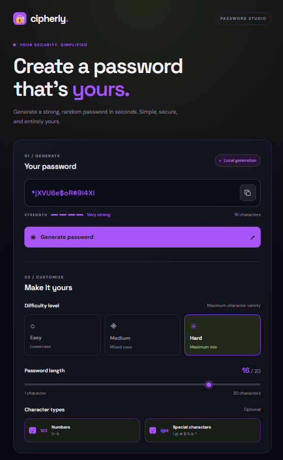

# Cipherly 🔐

A simple password generator built with HTML, CSS, and JavaScript. Generate random passwords with customizable length and complexity. Built as a frontend mini-project to practice JavaScript, DOM manipulation, event handling, and browser cryptography.

## ✨ Features

* Easy, Medium, and Hard difficulty levels
* Adjustable password length (1–20 characters)
* Optional numbers and special characters
* Password strength indicator
* One-click copy to clipboard
* Responsive dark-purple UI

## 📸 Screenshot



## 🛠️ Built With

* HTML5
* CSS3
* JavaScript

## 🚀 Getting Started

1. Clone the repository:

   ```bash
   git clone https://github.com/manishdotin/Cipherly.git
   ```
2. Open the project folder.
3. Open `source/index.html` in your browser.

## 📁 Project Structure

```text
cipherly/
├── source/
│   ├── index.html
│   ├── style.css
│   └── script.js
├── screenshot/
│   └── cipherly.png
└── README.md
```

## 🔒 Privacy

Passwords are generated locally in your browser. No account or server is required.

